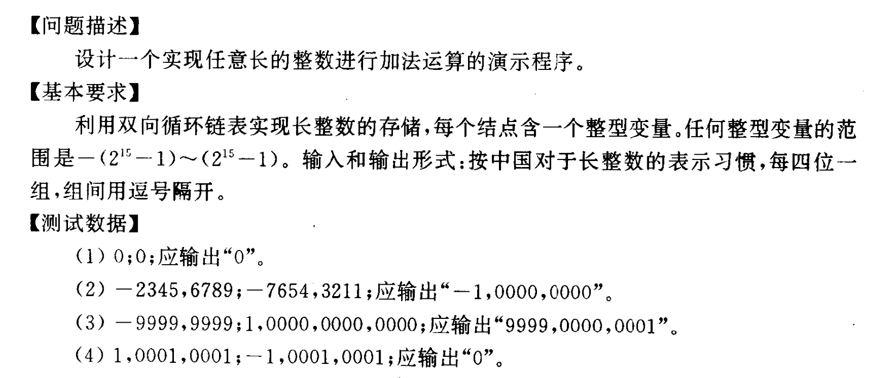
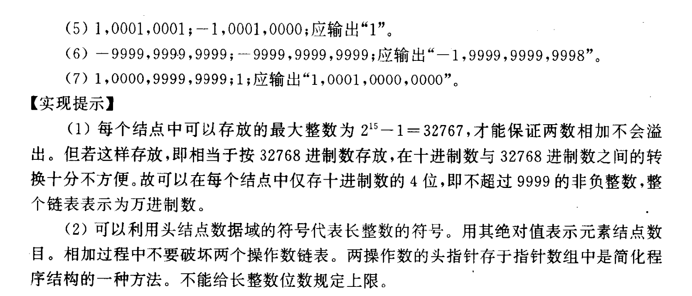
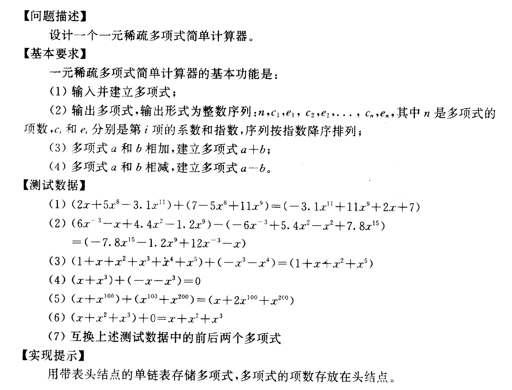

# 实验一

2023.9.27（周三）晚 7 点 @ 电三408

**说明**：

- 以下三题三选一；
- 每题都设有选做内容，完成选做内容将标记上 bonus，作为期末评分的参考之一；
- 对输入和输出格式不做要求，你既可以按照题目描述的（如果有）来实现，也可以用自己喜欢的方式；对实现细节亦不做要求，只要合理即可。

## 1. 长整数四则运算

题集 P80 1.4

### 选做内容

实现长整数的乘法。

## 2. 一元稀疏多项式计算器

题集 P80 1.5

### 选做内容

实现一元稀疏多项式的乘法。

## 3. 图书管理系统

