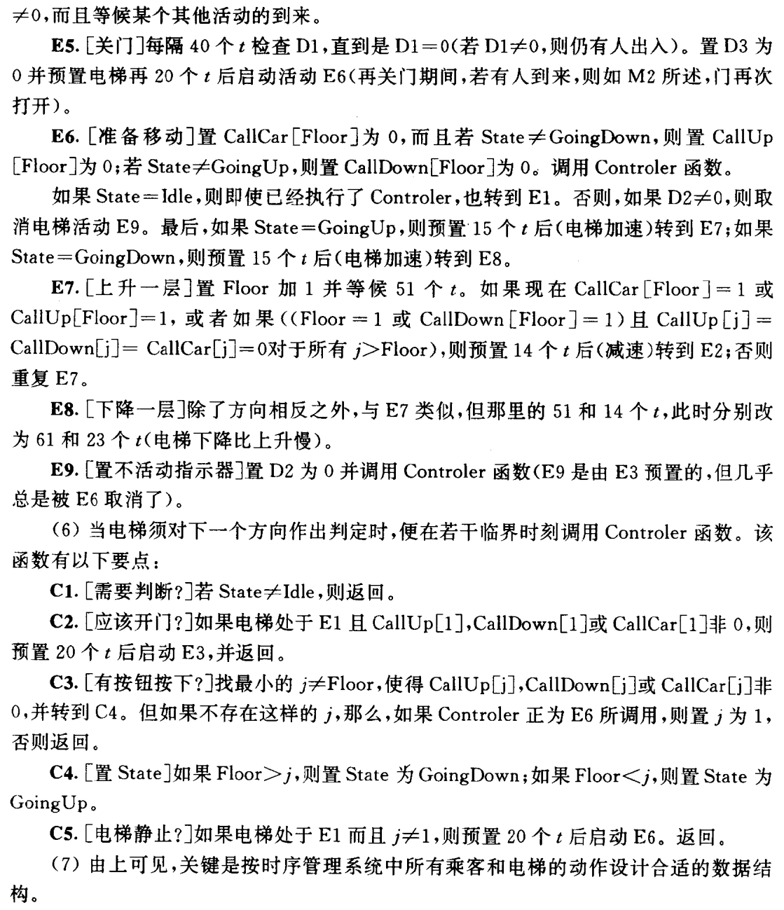

# 实验二

## 时间

两次上机，第二次上机为验收的 DDL。

1. 2023.10.25（周三）
2. 2023.11.1（周三）

## 说明

- 以下三题三选一；
- 每题都设有选做内容，完成选做内容将标记上 bonus，作为期末评分的参考之一；
- 对输入和输出格式不做要求，你既可以按照题目描述的（如果有）来实现，也可以用自己喜欢的方式；
- 对实现细节不做要求，合理即可。

## 1. 银行业务模拟

题集 P100 2.6

### 选做内容

## 2. 航空客运订票系统

题集 P101 2.7

### 选做内容

当客户订票要求不能满足时，系统可向客户提供到达同一目的地的其他航线情况。

## 3. 电梯模拟

题集 P102 2.8

### 选做内容

增加电梯数量，模拟多梯系统。
